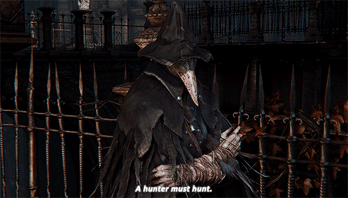

# Hoontr - 



_A hoontr must hoont - Eileen the Crow_ 

Hoontr is a utility tool made for malware developers and red teamers which tries to serve as a Swiss Army Knife of DLL hunting for various artefacts. Currently, there are 3 modes supported:

- stomphoont: This mode is used to find the right PEs to stomp. This module searches for PEs in a given path which have a `.text` section equal to or greater than the provided size. 

- exporthoont: This mode is used to find modules which can be used for finding PEs which have exports containing a specific substring.

- bytehoont: This mode is used to hunt for a give byte sequence in the `.text` section of the specified PEs.


The program hunts for the selected artefacts using multiple threads determined by the number of hyperthreaded cpu cores present on the machine and prints the results to stdout 🦀 


## Building the project

```bash
$ git clone https://github.com/whokilleddb/hoontr
$ cd hoontr
$ cargo build --release 
```

## Usage 

Once you have compiled the binary, you can check the help menu by using the `-h`/`--help` flag:

```
$ hoontr.exe --help
Hoontr - Find the right DLL for the job

Usage: hoontr.exe <COMMAND>

Commands:
  bytehoont    Enumerate for a particular byte sequence
  stomphoont   Enumerate for dlls to stomp
  exporthoont  Enumerate DLLs for exported functions
  help         Print this message or the help of the given subcommand(s)

Options:
  -h, --help     Print help
  -V, --version  Print version
```

### stomphoont

To get more verbose information about the different flags the mode uses:

```bash
$ hoontr.exe stomphoont --help
Enumerate for dlls to stomp

Usage: hoontr.exe stomphoont [OPTIONS] --size <SHELLCODE_SIZE>

Options:
  -s, --size <SHELLCODE_SIZE>  Minimum size of .text size section to look for
      --no-cfg                 Only include DLLs with CFG disabled
  -p, --path <PATH>            Path to file or folder to enumerate [default: C:\Windows\System32]
      --nobanner               Do not print intro banner
  -r, --recurse                If the value specified by --path is a directory, recursively enumerate all subdirectories
      --pe                     Include other PE files like EXEs and CPLs in scope as well
      --arch <ARCH>            Target architecture [default: all] [possible values: all, x86, x64]
  -h, --help                   Print help
```

Example Usage:

```bash
$ hoontr.exe stomphoont --size 9999 --no-cfg --pe --arch x64

     __  __                          __
    /\ \/\ \                        /\ \__
    \ \ \_\ \    ___     ___     ___\ \ ,_\  _ __
     \ \  _  \  / __`\  / __`\ /' _ `\ \ \/ /\`'__\
      \ \ \ \ \/\ \L\ \/\ \L\ \/\ \/\ \ \ \_\ \ \/
       \ \_\ \_\ \____/\ \____/\ \_\ \_\ \__\\ \_\
        \/_/\/_/\/___/  \/___/  \/_/\/_/\/__/ \/_/

        A hoontr must hoont - Eileen the Crow


[+] Selected 4118 targets for hoonting using 2 threads
[+] Target path: C:\Windows\System32
[+] Searching for artefacts with a `.text` section with a virtual size of 9999 bytes or more

        | ARCHITECTURE  | IS MANAGED?   | CFG STATUS    | DLL (VIRTUAL SIZE)
        | x64           | YES           | DISABLED      | C:\Windows\System32\NAPCRYPT.DLL (14358)
        | x64           | YES           | DISABLED      | C:\Windows\System32\dnscmmc.dll (62208)
        | x64           | NO            | DISABLED      | C:\Windows\System32\securekernel.exe (939928)
        | x64           | NO            | DISABLED      | C:\Windows\System32\securekernella57.exe (896888)
        | x64           | YES           | DISABLED      | C:\Windows\System32\fhuxgraphics.dll (14944)
        | x64           | YES           | DISABLED      | C:\Windows\System32\FileHistory.exe (29347)
        | x64           | NO            | DISABLED      | C:\Windows\System32\SqlServerSpatial150.dll (477861)
        | x64           | YES           | DISABLED      | C:\Windows\System32\srmlib.dll (74650)
        | x64           | NO            | DISABLED      | C:\Windows\System32\hvloader.dll (123420)
        | x64           | NO            | DISABLED      | C:\Windows\System32\tcblaunch.exe (943860)
        | x64           | YES           | DISABLED      | C:\Windows\System32\tzsync.exe (231840)
        | x64           | NO            | DISABLED      | C:\Windows\System32\libomp140.x86_64.dll (458385)
        | x64           | NO            | DISABLED      | C:\Windows\System32\libomp140d.x86_64.dll (1031805)
        | x64           | NO            | DISABLED      | C:\Windows\System32\vsjitdebugger.exe (216504)
        | x64           | NO            | DISABLED      | C:\Windows\System32\winload.exe (1499637)
        | x64           | NO            | DISABLED      | C:\Windows\System32\winresume.exe (1161744)
        | x64           | NO            | DISABLED      | C:\Windows\System32\mscories.dll (53691)
```

### exporthoont

To get more verbose information about the different flags the mode uses:

```bash
$ hoontr.exe exporthoont --help
Enumerate DLLs for exported functions

Usage: hoontr.exe exporthoont [OPTIONS] --name <FUNC_NAME>

Options:
  -n, --name <FUNC_NAME>  String to look for in function names in a case insensitive manner
      --match-case        Match case of provided string
  -p, --path <PATH>       Path to file or folder to enumerate [default: C:\Windows\System32]
      --nobanner          Do not print intro banner
  -r, --recurse           If the value specified by --path is a directory, recursively enumerate all subdirectories
      --pe                Include other PE files like EXEs and CPLs in scope as well
      --arch <ARCH>       Target architecture [default: all] [possible values: all, x86, x64]
  -h, --help              Print help
```

Example Usage:

```bash
$ hoontr.exe exporthoont --name NtReadFile --match-case

     __  __                          __
    /\ \/\ \                        /\ \__
    \ \ \_\ \    ___     ___     ___\ \ ,_\  _ __
     \ \  _  \  / __`\  / __`\ /' _ `\ \ \/ /\`'__\
      \ \ \ \ \/\ \L\ \/\ \L\ \/\ \/\ \ \ \_\ \ \/
       \ \_\ \_\ \____/\ \____/\ \_\ \_\ \__\\ \_\
        \/_/\/_/\/___/  \/___/  \/_/\/_/\/__/ \/_/

        A hoontr must hoont - Eileen the Crow


[+] Selected 3469 targets for hoonting using 2 threads
[+] Target path: C:\Windows\System32
[+] Searching for artefacts which exports the function with the following string: NtReadFile

[+] Matches found in: C:\Windows\System32\ntdll.dll (ARCH: x64 | Is Managed DLL: NO)

        NtReadFile, NtReadFileScatter,

        Total matches found: 2

[+] Matches found in: C:\Windows\System32\dmutil.dll (ARCH: x64 | Is Managed DLL: NO)

        LowNtReadFile,

        Total matches found: 1
```

### bytehoont

To get more verbose information about the different flags the mode uses:

```bash
$ hoontr.exe bytehoont --help
Enumerate for a particular byte sequence

Usage: hoontr.exe bytehoont [OPTIONS] --file <BYTE_FILE>

Options:
  -f, --file <BYTE_FILE>  Path to a file containing the byte sequence to find
  -p, --path <PATH>       Path to file or folder to enumerate [default: C:\Windows\System32]
      --nobanner          Do not print intro banner
  -r, --recurse           If the value specified by --path is a directory, recursively enumerate all subdirectories
      --pe                Include other PE files like EXEs and CPLs in scope as well
      --arch <ARCH>       Target architecture [default: all] [possible values: all, x86, x64]
  -h, --help              Print help

```

Example Usage:

```bash
$ hoontr.exe bytehoont --file syscallret.bin

     __  __                          __
    /\ \/\ \                        /\ \__
    \ \ \_\ \    ___     ___     ___\ \ ,_\  _ __
     \ \  _  \  / __`\  / __`\ /' _ `\ \ \/ /\`'__\
      \ \ \ \ \/\ \L\ \/\ \L\ \/\ \/\ \ \ \_\ \ \/
       \ \_\ \_\ \____/\ \____/\ \_\ \_\ \__\\ \_\
        \/_/\/_/\/___/  \/___/  \/_/\/_/\/__/ \/_/

        A hoontr must hoont - Eileen the Crow


[+] Selected 3469 targets for hoonting using 2 threads
[+] Target path: C:\Windows\System32
[+] Searching for artefacts with a `.text` section with the following bytecode: 0f 05 c3

[+] Opcode matches found in C:\Windows\System32\ntdll.dll (Arch: x64 | Managed DLL: NO) at the following offsets:

        0x160952, 0x160972, 0x160992, 0x1609B2, 0x1609D2, 0x1609F2, 0x160DD2, 0x160DF2,
        0x160E12, 0x160E32, 0x160E52, 0x160E72, 0x160E92, 0x160EB2, 0x160ED2, 0x160EF2,
        0x160F12, 0x160F32, 0x160F52, 0x160F72, 0x160F92, 0x160FB2, 0x160FD2, 0x160FF2,
        0x161012, 0x161032, 0x161052, ....

```

## TODO
- Add more BloodBorne references
